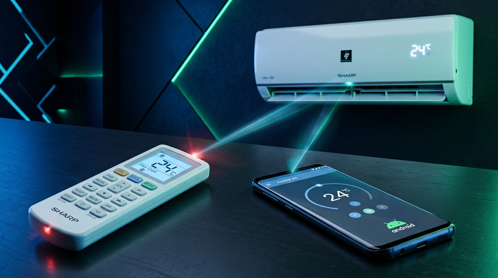
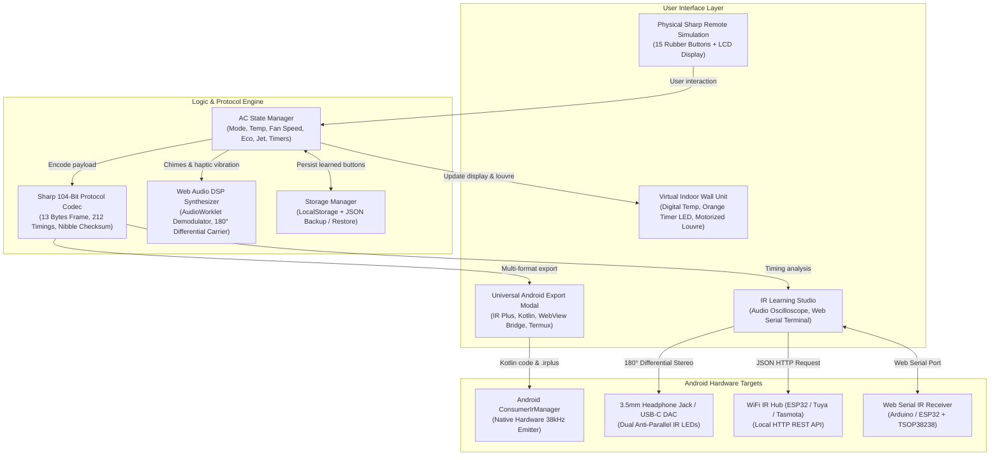

<div align="center">



# sharp-a_c-ir-remote-&-learner-for-android

**Universal Sharp Inverter A/C Remote Simulator & Infrared (IR) Learning Studio for Android**

[](package.json)
[](https://react.dev/)
[](https://www.typescriptlang.org/)
[](https://vitejs.dev/)
[](https://tailwindcss.com/)
[](https://web.dev/progressive-web-apps/)
[](https://developer.android.com/reference/android/hardware/ConsumerIrManager)
[](LICENSE)

<p align="center" id="top">
  <b>English (Default)</b>
  &nbsp;&bull;&nbsp;
  <a href="README.vi.md">Tiếng Việt</a>
</p>

</div>

---

<div align="right">
  <a href="#top"><b>Back to top</b></a>
</div>

## English Documentation

### 1. Overview

**`sharp-a_c-ir-remote-&-learner-for-android`** is a comprehensive software suite designed to simulate, analyze, learn, and transmit infrared (IR) signals for **Sharp Inverter / Plasmacluster** air conditioners.

The application is engineered to work universally across all Android devices:
- **Android devices with built-in IR Blaster** (Xiaomi, Redmi, Poco, Huawei, Honor, Vivo, Oppo, TCL, HTC, LG): Directly utilize `ConsumerIrManager` or export to ready-to-run IR Plus profiles and Termux commands.
- **Android devices without built-in IR Blaster** (Samsung Galaxy S series, Google Pixel, OnePlus, tablets): Full support via 3.5mm audio jack differential modulation, Type-C IR dongles, Smart WiFi IR bridges (ESP32/Tasmota/Tuya), or Web Bluetooth.
- **Android WebView & Native App Wrappers**: Built-in JavascriptInterface bridge support (`window.AndroidIr`) for seamless 1-click native APK deployment.

<div align="right">
  <a href="#top"><b>Back to top</b></a>
</div>

---

### 2. Architecture & Working Principles



<div align="right">
  <a href="#top"><b>Back to top</b></a>
</div>

---

### 3. Sharp 104-Bit Protocol Specification

The Sharp A/C infrared protocol uses **Pulse Distance Modulation (PDM)** at a **38,000 Hz (38 kHz)** carrier frequency.
Timing constants verified against the [IRremoteESP8266](https://github.com/crankyoldgit/IRremoteESP8266) library (`ir_Sharp.h`, models AY-ZP40KR / CRMC-A907).

```
[HEADER MARK] [HEADER SPACE] [BIT] ... [BIT] [STOP MARK] [GAP]
   3800 µs       1900 µs     470 µs   ...    470 µs     40000 µs
```

- **Header Leader**: `3800 µs Mark` + `1900 µs Space`
- **Bit mark**: `470 µs` (common to both 0 and 1)
- **Bit logic 0**: `470 µs Mark` + `500 µs Space` (970 µs total)
- **Bit logic 1**: `470 µs Mark` + `1400 µs Space` (1870 µs total)
- **Stop Bit**: `470 µs Mark` + `40000 µs Gap Space`
- **Frame Length**: 13 Bytes (104 bits, transmitted LSB first per byte)
- **Timing Array Length**: 2 (Header) + (104 × 2) + 2 (Stop) = **212 pulses**

#### 13-Byte Payload Structure (A907 model, IRremoteESP8266 layout)

```
Byte 0:  0xAA  (Customer Code 1)
Byte 1:  0x5A  (Customer Code 2)
Byte 2:  0xCF  (Model Identifier)
Byte 3:  0x10  (Protocol Version)
Byte 4:  [Bit 3..0: Temp - 15 (0..15)] [Bit 4: Model]
Byte 5:  [Bit 7..4: PowerSpecial (0x0=Stay, 0x2=ON, 0x1=OFF)]
Byte 6:  [Bit 1..0: Mode (1:Cool, 2:Dry, 3:Auto)] [Bit 3: Clean] [Bit 6..4: Fan speed]
Byte 7:  [Bit 3..0: TimerHours] [Bit 6: TimerType (0:ON, 1:OFF)] [Bit 7: TimerEnabled]
Byte 8:  [Bit 2..0: Swing (0x00:Off, 0x07:On/Auto)]
Byte 9:  Special modes (Jet, Baby, Gentle Breeze, Sleep, Eco)
Byte 10: Command marker (0x00: normal, 0xEE: cancel timer, 0xFF: factory reset)
Byte 11: Ion / Model2 flags (0x00 standard)
Byte 12: [Bit 7..4: Checksum nibble = sum of all nibbles in bytes 0-11, masked 0x0F]
```

<div align="right">
  <a href="#top"><b>Back to top</b></a>
</div>

---

### 4. 15 Physical Remote Button Functions

| No. | Key Name | Symbol | Standard Function | State Impact |
|:---:|:---|:---:|:---|:---|
| 1 | **ON/OFF** | Power | Power toggle | Toggles power, double chime on activation |
| 2 | **JET** | Zap | Maximum rapid cooling (16°C) | Locks temp to 16°C and fan to maximum |
| 3 | **Baby Mode** | Smile | Gentle comfort cooling for infants | Low noise airflow, balanced comfortable temperature |
| 4 | **▲ (Temp Up)** | ChevronUp | Increase target temperature (+1°C) | Range 16°C to 30°C (cool) or ±2°C (dry) |
| 5 | **▼ (Temp Down)**| ChevronDown | Decrease target temperature (-1°C) | Range 16°C to 30°C (cool) or ±2°C (dry) |
| 6 | **Gentle Breeze**| Wind | Ceiling airflow deflection | Louvres angle upward to avoid direct draft on humans |
| 7 | **MODE** | Sliders | Cycle operation modes | Cool -> Dry -> Auto -> Cool |
| 8 | **FAN** | Fan | 5 fan speeds | 1: Quiet -> 2: Soft -> 3: Low -> 4: High -> 5: Auto |
| 9 | **SWING** | RefreshCw | Automatic vertical oscillation | Louvres swing continuously up and down |
| 10 | **ON Timer** | Clock | Delay start timer (0.5h to 12h) | Activates countdown, lights up orange timer LED |
| 11 | **OFF Timer** | Clock | Delay stop timer (0.5h to 12h) | Activates countdown, lights up orange timer LED |
| 12 | **ECO** | Leaf | Energy saver mode | Level 1 (-3%) -> Level 2 (-6%) -> Off |
| 13 | **SLEEP** | Moon | Sleep comfort curve | Increases target temperature by 1°C after 1 hour |
| 14 | **CANCEL** | XCircle | Clear timer delay | Clears active timer and extinguishes orange LED |
| 15 | **RESET** | RotateCcw | Factory reset | Restores 24°C, Auto Fan, clears all timers |

<div align="right">
  <a href="#top"><b>Back to top</b></a>
</div>

---

### 5. Universal Android Integration

#### Option 1: IR Plus App Profile (.irplus)
1. In the app, open the **Android IR Guide** modal and click **Download sharp_ac_android_remote.irplus**.
2. Open **IR Plus** (available on Google Play / Xiaomi GetApps).
3. Tap menu (⋮) -> **Import** -> Select the `.irplus` file. The phone's IR transmitter is immediately ready to control the air conditioner.

#### Option 2: Android Kotlin ConsumerIrManager Snippet
Use this snippet in any Android application targeting API level 19+:

```kotlin
package com.sharp.remote.ir

import android.content.Context
import android.hardware.ConsumerIrManager

class SharpAcController(private val context: Context) {
    private val irManager: ConsumerIrManager? =
        context.getSystemService(Context.CONSUMER_IR_SERVICE) as? ConsumerIrManager

    fun hasEmitter(): Boolean = irManager?.hasIrEmitter() == true

    fun transmitPattern(carrierFreq: Int, timings: IntArray) {
        if (hasEmitter()) {
            irManager?.transmit(carrierFreq, timings)
        }
    }
}
```

#### Option 3: Android WebView JavascriptInterface Bridge
When packaging this web application inside an Android WebView, inject this bridge interface to allow the web buttons to trigger hardware IR directly:

```kotlin
class AndroidIrBridge(private val context: Context) {
    private val irManager = context.getSystemService(Context.CONSUMER_IR_SERVICE) as? ConsumerIrManager

    @android.webkit.JavascriptInterface
    fun hasIrEmitter(): Boolean = irManager?.hasIrEmitter() == true

    @android.webkit.JavascriptInterface
    fun transmit(carrierFrequency: Int, patternCsv: String) {
        val pattern = patternCsv.split(",").mapNotNull { it.trim().toIntOrNull() }.toIntArray()
        if (pattern.isNotEmpty()) {
            irManager?.transmit(carrierFrequency, pattern)
        }
    }
}

// In your Activity:
// webView.addJavascriptInterface(AndroidIrBridge(this), "AndroidIr")
```

#### Option 4: Termux CLI (Termux:API)
```bash
pkg install termux-api -y
# Sharp A/C power ON, Cool 24°C — correct timings (IRremoteESP8266 verified)
termux-infrared-transmit -f 38000 3800,1900,470,500,470,1400,470,500,...
```

<div align="right">
  <a href="#top"><b>Back to top</b></a>
</div>

---

### 6. 5 IR Learning Methods & Hardware Capabilities

The application provides 5 distinct methods for configuring and acquiring Sharp A/C IR signals:

1. **Sharp 104-Bit Factory Presets (Recommended)**: Pre-compiled library matching the official `IRremoteESP8266` standard (AY-ZP40KR / CRMC-A907 models). Produces exact 212-pulse frames (Header: 3800/1900µs, Mark: 470µs, Bit 1: 1400µs, Bit 0: 500µs) with automated checksum generation.
2. **USB Serial Hardware Receiver (Web Serial API - Most Accurate)**: Connect an external Arduino Nano/Uno or ESP32 with a TSOP38238 receiver via USB or Android USB-OTG. The microcontroller samples microsecond pulses using hardware timer interrupts and streams decoded timings directly into Chrome/Edge at 115200 baud.
3. **3.5mm Audio Jack / Mic Pin (AudioWorklet Demodulator)**: Uses dedicated `AudioWorklet` thread processing with a 1.5-second ambient RMS noise auto-calibration phase, active-low polarity handling for TSOP sensors, and real-time canvas oscilloscope display.
4. **Manual Code Input**: Directly paste raw microsecond timing arrays or Pronto Hex strings (`0000 006D ...`) with real-time protocol verification and duration calculation.
5. **Camera Optical Tester (Presence Test Only)**: Designed specifically to verify whether a physical remote's IR LED is functioning and emitting infrared light (visible as a violet/purple flicker on camera sensors). *Technical note: standard 30fps camera sensors (33ms per frame) cannot sample 38kHz / microsecond pulses, so this mode acts as a transmitter health validator rather than a pulse decoder.*

<div align="right">
  <a href="#top"><b>Back to top</b></a>
</div>

---

### 7. Local Setup & Scripts

#### Prerequisites
- **Node.js**: `>= 18.0.0` (Node 20+ or 25 recommended)
- **NPM**: `>= 9.0.0`

#### Getting Started

```bash
# 1. Clone repository
git clone https://github.com/your-username/sharp-a_c-ir-remote-&-learner-for-android.git

# 2. Navigate to directory
cd sharp-a_c-ir-remote-&-learner-for-android

# 3. Install dependencies
npm install

# 4. Start local development server
npm run dev
```

Open your browser at `http://localhost:3000` (or your local network IP on Android via WiFi).

#### npm Scripts

| Script | Purpose |
|:---|:---|
| `npm run dev` | Launch Vite development server with HMR on port 3000 |
| `npm run build` | Compile optimized production bundle to `dist/` |
| `npm run preview` | Preview production build locally |
| `npm run lint` | Type-check TypeScript codebase (`tsc --noEmit`) |
| `npm run clean` | Clean build directory `dist/` cross-platform |

#### Makefile Targets

| Target | Description |
|:---|:---|
| `make install` | Compile web app, package APK, and install directly to connected Android phone |
| `make build` | Build web bundle and generate unsigned APK at `android/build/sharp-ac-remote.apk` |
| `make dev` | Launch Vite development server |
| `make launch` | Launch Sharp AC Remote app on phone via ADB |
| `make logcat` | Stream live IR transmission logs from phone via ADB |
| `make clean` | Remove temporary build files and generated APKs |

<div align="right">
  <a href="#top"><b>Back to top</b></a>
</div>

---

### 8. Directory Structure

```
sharp-a_c-ir-remote-&-learner-for-android/
├── .env.example                     # Environment variable template
├── .gitignore                       # Git ignore configuration
├── README.md                        # English documentation (Default)
├── README.vi.md                     # Vietnamese documentation
├── index.html                       # HTML5 Shell & PWA Meta
├── metadata.json                    # Project declarations
├── package.json                     # Dependencies & scripts
├── tsconfig.json                    # TypeScript configuration
├── vite.config.ts                   # Vite configuration & PWA Service Worker
├── android/                         # Android native wrapper & resources
├── docs/                            # Documentation assets & banners
├── public/                          # PWA icons & web manifest
├── scripts/                         # Build scripts for APK & icons
└── src/
    ├── App.tsx                      # Main app controller & routing
    ├── components/                  # UI components (Remote, Unit, Studio, Modals)
    ├── types/                       # TypeScript interfaces for AC state & IR
    └── utils/                       # Sharp protocol, AudioWorklet, Serial IR
```

<div align="right">
  <a href="#top"><b>Back to top</b></a>
</div>

---

## License

Distributed under the [MIT License](LICENSE).

```text
Made with ❤️ by nhattan
```
