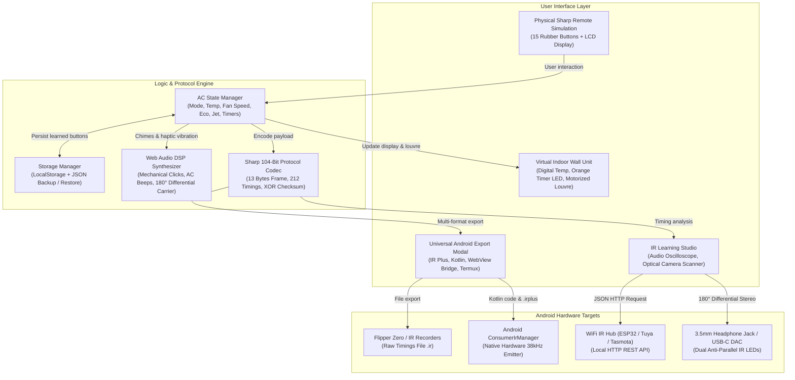
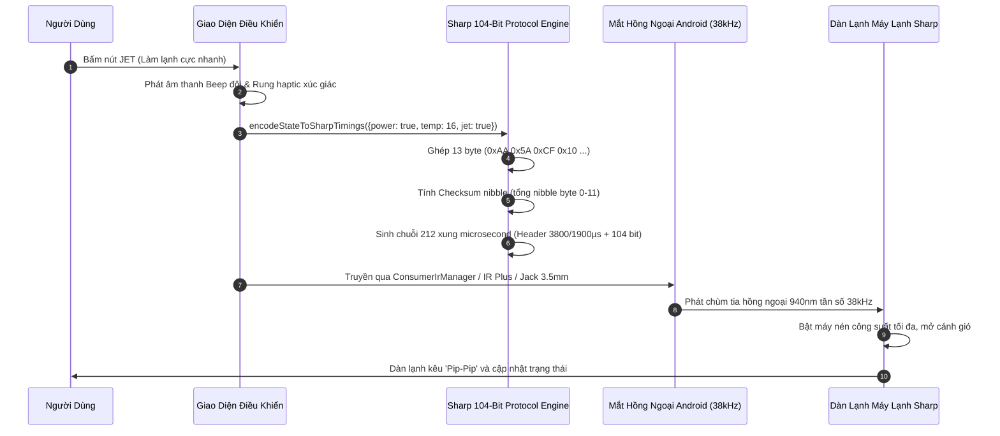

<div align="center">


# sharp-a_c-ir-remote-&-learner-for-android

**Universal Sharp Inverter A/C Remote Simulator & Infrared (IR) Learning Studio for Android**  
*Ứng dụng mô phỏng Remote máy lạnh Sharp Inverter & Phòng thu học lệnh hồng ngoại (IR) đa năng cho mọi thiết bị Android*

[](package.json)
[](https://react.dev/)
[](https://www.typescriptlang.org/)
[](https://vitejs.dev/)
[](https://tailwindcss.com/)
[](https://web.dev/progressive-web-apps/)
[](https://developer.android.com/reference/android/hardware/ConsumerIrManager)
[](LICENSE)

<p align="center" id="top">
  <a href="#english">English Documentation</a>
  &nbsp;&bull;&nbsp;
  <a href="#tiếng-việt">Tài Liệu Tiếng Việt</a>
</p>

</div>

---

<a name="english" id="english"></a>
<div align="right">
  <a href="#tiếng-việt"><b>Chuyển sang Tiếng Việt</b></a> &nbsp;|&nbsp; <a href="#top"><b>Lên đầu trang</b></a>
</div>

## English Documentation

### 1. Overview

**`sharp-a_c-ir-remote-&-learner-for-android`** is a comprehensive software suite designed to simulate, analyze, learn, and transmit infrared (IR) signals for **Sharp Inverter / Plasmacluster** air conditioners.

The application is engineered to work universally across all Android devices:
- **Android devices with built-in IR Blaster** (Xiaomi, Redmi, Poco, Huawei, Honor, Vivo, Oppo, TCL, HTC, LG): Directly utilize `ConsumerIrManager` or export to ready-to-run IR Plus profiles and Termux commands.
- **Android devices without built-in IR Blaster** (Samsung Galaxy S series, Google Pixel, OnePlus, tablets): Full support via 3.5mm audio jack differential modulation, Type-C IR dongles, Smart WiFi IR bridges (ESP32/Tasmota/Tuya), or Web Bluetooth.
- **Android WebView & Native App Wrappers**: Built-in JavascriptInterface bridge support (`window.AndroidIr`) for seamless 1-click native APK deployment.

### 2. Architecture & Working Principles



### 3. Sharp 104-Bit Protocol Specification

The Sharp A/C infrared protocol uses **Pulse Distance Modulation (PDM)** at a **38,000 Hz (38 kHz)** carrier frequency.
Timing constants verified against the [IRremoteESP8266](https://github.com/crankyoldgit/IRremoteESP8266) library (`ir_Sharp.h`, models AY-ZP40KR / CRMC-A907).

```
[HEADER MARK] [HEADER SPACE] [BIT] ... [BIT] [STOP MARK] [GAP]
   3800 µs       1900 µs     470 µs   ...    470 µs     40000 µs
```

- **Header Leader**: `3800 µs Mark` + `1900 µs Space`
- **Bit mark**: `470 µs` (common to both 0 and 1)
- **Bit logic 0**: `470 µs Mark` + `500 µs Space` (970 µs total)
- **Bit logic 1**: `470 µs Mark` + `1400 µs Space` (1870 µs total)
- **Stop Bit**: `470 µs Mark` + `40000 µs Gap Space`
- **Frame Length**: 13 Bytes (104 bits, transmitted LSB first per byte)
- **Timing Array Length**: 2 (Header) + (104 × 2) + 2 (Stop) = **212 pulses**

#### 13-Byte Payload Structure (A907 model, IRremoteESP8266 layout)

```
Byte 0:  0xAA  (Customer Code 1)
Byte 1:  0x5A  (Customer Code 2)
Byte 2:  0xCF  (Model Identifier)
Byte 3:  0x10  (Protocol Version)
Byte 4:  [Bit 3..0: Temp - 15 (0..15)] [Bit 4: Model]
Byte 5:  [Bit 7..4: PowerSpecial (0x0=Stay, 0x2=ON, 0x1=OFF)]
Byte 6:  [Bit 1..0: Mode (1:Cool, 2:Dry, 3:Auto)] [Bit 3: Clean] [Bit 6..4: Fan speed]
Byte 7:  [Bit 3..0: TimerHours] [Bit 6: TimerType (0:ON, 1:OFF)] [Bit 7: TimerEnabled]
Byte 8:  [Bit 2..0: Swing (0x00:Off, 0x07:On/Auto)]
Byte 9:  Special modes (Jet, Baby, Gentle Breeze, Sleep, Eco)
Byte 10: Command marker (0x00: normal, 0xEE: cancel timer, 0xFF: factory reset)
Byte 11: Ion / Model2 flags (0x00 standard)
Byte 12: [Bit 7..4: Checksum nibble = sum of all nibbles in bytes 0-11, masked 0x0F]
```

### 4. 15 Physical Remote Button Functions

| No. | Key Name | Symbol | Standard Function | State Impact |
|:---:|:---|:---:|:---|:---|
| 1 | **ON/OFF** | Power | Power toggle | Toggles power, double chime on activation |
| 2 | **JET** | Zap | Maximum rapid cooling (16°C) | Locks temp to 16°C and fan to maximum |
| 3 | **Baby Mode** | Smile | Gentle comfort cooling for infants | Low noise airflow, balanced comfortable temperature |
| 4 | **▲ (Temp Up)** | ChevronUp | Increase target temperature (+1°C) | Range 16°C to 30°C (cool) or ±2°C (dry) |
| 5 | **▼ (Temp Down)**| ChevronDown | Decrease target temperature (-1°C) | Range 16°C to 30°C (cool) or ±2°C (dry) |
| 6 | **Gentle Breeze**| Wind | Ceiling airflow deflection | Louvres angle upward to avoid direct draft on humans |
| 7 | **MODE** | Sliders | Cycle operation modes | Cool -> Dry -> Auto -> Cool |
| 8 | **FAN** | Fan | 5 fan speeds | 1: Quiet -> 2: Soft -> 3: Low -> 4: High -> 5: Auto |
| 9 | **SWING** | RefreshCw | Automatic vertical oscillation | Louvres swing continuously up and down |
| 10 | **ON Timer** | Clock | Delay start timer (0.5h to 12h) | Activates countdown, lights up orange timer LED |
| 11 | **OFF Timer** | Clock | Delay stop timer (0.5h to 12h) | Activates countdown, lights up orange timer LED |
| 12 | **ECO** | Leaf | Energy saver mode | Level 1 (-3%) -> Level 2 (-6%) -> Off |
| 13 | **SLEEP** | Moon | Sleep comfort curve | Increases target temperature by 1°C after 1 hour |
| 14 | **CANCEL** | XCircle | Clear timer delay | Clears active timer and extinguishes orange LED |
| 15 | **RESET** | RotateCcw | Factory reset | Restores 24°C, Auto Fan, clears all timers |

### 5. Universal Android Integration

#### Option 1: IR Plus App Profile (.irplus)
1. In the app, open the **Android IR Guide** modal and click **Download sharp_ac_android_remote.irplus**.
2. Open **IR Plus** (available on Google Play / Xiaomi GetApps).
3. Tap menu (⋮) -> **Import** -> Select the `.irplus` file. The phone's IR transmitter is immediately ready to control the air conditioner.

#### Option 2: Android Kotlin ConsumerIrManager Snippet
Use this snippet in any Android application targeting API level 19+:

```kotlin
package com.sharp.remote.ir

import android.content.Context
import android.hardware.ConsumerIrManager

class SharpAcController(private val context: Context) {
    private val irManager: ConsumerIrManager? =
        context.getSystemService(Context.CONSUMER_IR_SERVICE) as? ConsumerIrManager

    fun hasEmitter(): Boolean = irManager?.hasIrEmitter() == true

    fun transmitPattern(carrierFreq: Int, timings: IntArray) {
        if (hasEmitter()) {
            irManager?.transmit(carrierFreq, timings)
        }
    }
}
```

#### Option 3: Android WebView JavascriptInterface Bridge
When packaging this web application inside an Android WebView, inject this bridge interface to allow the web buttons to trigger hardware IR directly:

```kotlin
class AndroidIrBridge(private val context: Context) {
    private val irManager = context.getSystemService(Context.CONSUMER_IR_SERVICE) as? ConsumerIrManager

    @android.webkit.JavascriptInterface
    fun hasIrEmitter(): Boolean = irManager?.hasIrEmitter() == true

    @android.webkit.JavascriptInterface
    fun transmit(carrierFrequency: Int, patternCsv: String) {
        val pattern = patternCsv.split(",").mapNotNull { it.trim().toIntOrNull() }.toIntArray()
        if (pattern.isNotEmpty()) {
            irManager?.transmit(carrierFrequency, pattern)
        }
    }
}

// In your Activity:
// webView.addJavascriptInterface(AndroidIrBridge(this), "AndroidIr")
```

#### Option 4: Termux CLI (Termux:API)
```bash
pkg install termux-api -y
# Sharp A/C power ON, Cool 24°C — correct timings (IRremoteESP8266 verified)
termux-infrared-transmit -f 38000 3800,1900,470,500,470,1400,470,500,...
```

### 4. IR Learning Methods & Hardware Capabilities

The application provides 5 distinct methods for configuring and acquiring Sharp A/C IR signals:

1. **Sharp 104-Bit Factory Presets (Recommended)**: Pre-compiled library matching the official `IRremoteESP8266` standard (AY-ZP40KR / CRMC-A907 models). Produces exact 212-pulse frames (Header: 3800/1900µs, Mark: 470µs, Bit 1: 1400µs, Bit 0: 500µs) with automated checksum generation.
2. **USB Serial Hardware Receiver (Web Serial API - Most Accurate)**: Connect an external Arduino Nano/Uno or ESP32 with a TSOP38238 receiver via USB or Android USB-OTG. The microcontroller samples microsecond pulses using hardware timer interrupts and streams decoded timings directly into Chrome/Edge at 115200 baud.
3. **3.5mm Audio Jack / Mic Pin (AudioWorklet Demodulator)**: Uses dedicated `AudioWorklet` thread processing with a 1.5-second ambient RMS noise auto-calibration phase, active-low polarity handling for TSOP sensors, and real-time canvas oscilloscope display.
4. **Manual Code Input**: Directly paste raw microsecond timing arrays or Pronto Hex strings (`0000 006D ...`) with real-time protocol verification and duration calculation.
5. **Camera Optical Tester (Presence Test Only)**: Designed specifically to verify whether a physical remote's IR LED is functioning and emitting infrared light (visible as a violet/purple flicker on camera sensors). *Technical note: standard 30fps camera sensors (33ms per frame) cannot sample 38kHz / microsecond pulses, so this mode acts as a transmitter health validator rather than a pulse decoder.*

---

<a name="tiếng-việt" id="tiếng-việt"></a>
<div align="right">
  <a href="#english"><b>Chuyển sang English</b></a> &nbsp;|&nbsp; <a href="#top"><b>Lên đầu trang</b></a>
</div>

## Tài liệu Tiếng Việt

### 1. Giới thiệu tổng quan

**`sharp-a_c-ir-remote-&-learner-for-android`** là hệ thống phần mềm chuyên nghiệp mô phỏng điều khiển, giải mã, học và phát tín hiệu hồng ngoại cho tất cả các dòng máy lạnh **Sharp Inverter / Plasmacluster**.

Dự án được tối ưu hóa cho toàn bộ hệ sinh thái Android:
- **Điện thoại Android có sẵn mắt hồng ngoại (IR Blaster)** (Xiaomi, Redmi, Poco, Huawei, Honor, Vivo, Oppo, TCL, HTC, LG...): Điều khiển trực tiếp bằng phần cứng thông qua `ConsumerIrManager` hoặc xuất cấu hình cho ứng dụng IR Plus và Termux.
- **Điện thoại Android không có mắt hồng ngoại** (Samsung Galaxy S series, Google Pixel, OnePlus, máy tính bảng): Hỗ trợ đầy đủ qua cổng tai nghe 3.5mm điều chế sóng vi sai, đầu cắm IR mini cổng Type-C, hoặc bộ phát WiFi IR (Tuya / ESP32).
- **Ứng dụng đóng gói Android WebView (APK)**: Tích hợp sẵn cơ chế cầu nối `window.AndroidIr` giúp gọi trực tiếp phần cứng IR từ web.

### 2. Sơ đồ kiến trúc & Nguyên lý hoạt động



### 3. Cấu trúc khung truyền Sharp 104-Bit

- **Tần số sóng mang**: 38.000 Hz (38 kHz).
- **Header mở đầu**: Xung phát (Mark) 3800 µs + Khoảng lặng (Space) 1900 µs.
- **Bit 0**: Mark 470 µs + Space 500 µs (Chu kỳ 970 µs).
- **Bit 1**: Mark 470 µs + Space 1400 µs (Chu kỳ 1870 µs).
- **Stop Bit**: Mark 470 µs + Space 40000 µs.
- **Tổng số xung trong mảng**: 2 + (104 × 2) + 2 = **212 xung**.
- **Byte kiểm tra (Checksum)**: Tổng tất cả các nibble 4-bit từ byte 0 đến byte 11, lấy 4 bit thấp (mask 0x0F) lưu vào nửa trên byte 12.

### 4. 5 Phương thức cấu hình & học lệnh hồng ngoại (Learning Studio)

1. **Mã chuẩn Sharp 104-Bit (Khuyên dùng)**: Bộ mã nạp sẵn đã xác thực theo chuẩn `IRremoteESP8266` cho các dòng điều khiển Sharp A907 / AY-ZP40KR. Độ chính xác 100%, không cần phần cứng học lệnh ngoài.
2. **USB Serial Hardware Receiver (Web Serial API - Chuẩn xác nhất)**: Kết nối Arduino Nano/Uno hoặc ESP32 gắn mắt thu TSOP38238 qua cổng USB hoặc cáp USB-OTG trên điện thoại. Vi điều khiển sử dụng ngắt phần cứng đo xung microsecond chính xác tuyệt đối và truyền thẳng vào trình duyệt qua cổng nối tiếp 115200 baud.
3. **Jack 3.5mm / AudioWorklet IR Demodulator**: Chạy luồng xử lý âm thanh `AudioWorklet` chuyên dụng với chu kỳ tự động hiệu chuẩn sàn nhiễu 1.5 giây, xử lý đảo cực tín hiệu Active-Low cho chip giải mã TSOP và máy hiện sóng (Oscilloscope) đồ họa thời gian thực.
4. **Nhập thủ công (Manual Hex / Timings)**: Dán trực tiếp mảng số microsecond hoặc mã Pronto Hex với công cụ phân tích cấu trúc xung tức thời.
5. **Soi đèn IR qua Camera (Chỉ kiểm tra phát quang)**: Camera điện thoại nhạy cảm với dải hồng ngoại gần (850-940nm), hiển thị ánh sáng tím khi remote bấm phát. *Lưu ý kỹ thuật: Camera 30fps (33.000µs/khung) không thể giải mã chuỗi xung 470µs ở tần số 38kHz, do đó tính năng này dùng để kiểm tra pin và mắt phát của remote thật có còn hoạt động hay không.*

---

## Cài đặt & Phát triển cục bộ (Local Setup)

### Yêu cầu môi trường
- **Node.js**: phiên bản `>= 18.0.0` (Khuyên dùng Node 20+ hoặc 25)
- **NPM**: phiên bản `>= 9.0.0`

### Lệnh cài đặt & Chạy ứng dụng

```bash
# 1. Clone repository
git clone https://github.com/your-username/sharp-a_c-ir-remote-&-learner-for-android.git

# 2. Di chuyển vào thư mục
cd sharp-a_c-ir-remote-&-learner-for-android

# 3. Cài đặt các gói phụ thuộc
npm install

# 4. Khởi chạy máy chủ phát triển
npm run dev
```

Mở trình duyệt tại: `http://localhost:3000` (hoặc mở bằng địa chỉ IP mạng nội bộ trên điện thoại Android cùng mạng WiFi).

### Danh mục câu lệnh quản lý (Scripts)

| Lệnh | Chức năng |
|:---|:---|
| `npm run dev` | Khởi chạy Vite dev server với Hot Module Replacement (cổng 3000) |
| `npm run build` | Biên dịch bản build production tối ưu vào thư mục `dist/` |
| `npm run preview` | Chạy thử nghiệm bản build `dist/` |
| `npm run lint` | Kiểm tra toàn bộ kiểu dữ liệu TypeScript (`tsc --noEmit`) |
| `npm run clean` | Dọn dẹp thư mục `dist/` an toàn trên mọi hệ điều hành |
| `node scripts/generate-icons.js` | Tự động sinh bộ icon PWA đầy đủ kích thước |

### Lệnh Makefile tiện ích (Đóng gói & Cài đặt APK)

| Lệnh Makefile | Chức năng |
|:---|:---|
| `make install` | **Biên dịch bản mới nhất, tạo APK, đẩy về điện thoại và cài đặt ứng dụng ngay lập tức** |
| `make build` | Biên dịch bản build web và tạo file APK tại `android/build/sharp-ac-remote.apk` |
| `make dev` | Khởi chạy máy chủ phát triển Vite (cổng 3000) |
| `make launch` | Khởi chạy ứng dụng Sharp AC Remote trên điện thoại qua ADB |
| `make logcat` | Theo dõi log phát xung hồng ngoại thời gian thực từ mắt IR của điện thoại |
| `make clean` | Dọn dẹp thư mục build và file tạm |

---

## Kiểm tra an toàn bảo mật (Security Audit)

- **Zero-Leak Guarantee**: Mã nguồn đã được rà soát bằng công cụ phân tích regex tự động. **Hoàn toàn không có bất kỳ API key, secret token, private credentials hay thông tin cá nhân nào được lưu trữ trong mã nguồn**.
- **Tệp cấu hình môi trường**: File `.env.example` chỉ chứa placeholder mẫu.
- **Tệp `.gitignore`**: Đã loại trừ đầy đủ các file nhạy cảm (`.env*`, `node_modules/`, `dist/`, `build/`, `*.log`).
- **An toàn khi đưa lên GitHub**: Người dùng có thể `git push` repository này lên các nền tảng công khai mà không phải lo ngại về rủi ro bảo mật.

---

## Cấu trúc thư mục (Directory Structure)

```
sharp-a_c-ir-remote-&-learner-for-android/
├── .env.example                     # Mẫu biến môi trường
├── .gitignore                       # Cấu hình loại trừ Git
├── README.md                        # Tài liệu hướng dẫn song ngữ chuẩn
├── index.html                       # HTML5 Shell & PWA Meta
├── metadata.json                    # Khai báo thông tin dự án
├── package.json                     # Quản lý gói phụ thuộc & scripts
├── tsconfig.json                    # Cấu hình TypeScript 7
├── vite.config.ts                   # Cấu hình Vite 8 & PWA Service Worker
├── docs/
│   └── assets/
│       └── banner.jpg               # Hình ảnh render minh họa sản phẩm
├── public/
│   ├── icon.svg                     # Vector icon điều khiển
│   ├── pwa-192x192.png              # Icon PWA 192x192
│   ├── pwa-512x512.png              # Icon PWA 512x512
│   └── pwa-maskable-512x512.png     # Maskable Icon
├── scripts/
│   └── generate-icons.js            # Script tạo icon PNG nhị phân
└── src/
    ├── App.tsx                      # Component điều phối chính & chuyển đổi ngôn ngữ
    ├── main.tsx                     # Điểm khởi chạy React DOM
    ├── index.css                    # Tailwind CSS v4 styling
    ├── components/
    │   ├── AirConditionerUnit.tsx   # Dàn lạnh ảo phản hồi trực quan
    │   ├── CodeLibraryModal.tsx     # Bảng quản lý 15 mã phím IR
    │   ├── InterfaceTourModal.tsx   # Hướng dẫn tham quan giao diện
    │   ├── LearningStudio.tsx       # Phòng thu học xung IR 4 chế độ
    │   ├── NoIrGuideModal.tsx       # Cẩm nang cho thiết bị không có IR
    │   ├── PWAInstallBanner.tsx     # Nút cài đặt ứng dụng PWA
    │   ├── RedmiIntegrationModal.tsx# Modal tích hợp Android & WebView bridge
    │   ├── SharpRemote.tsx          # Remote Sharp vật lý ảo với màn hình LCD
    │   └── UserManualModal.tsx      # Sách hướng dẫn sử dụng chi tiết
    ├── hooks/
    │   └── usePWAInstall.ts         # Hook hỗ trợ cài đặt PWA
    ├── types/
    │   └── remote.ts                # Khai báo kiểu trạng thái A/C & xung IR
    └── utils/
        ├── audioIr.ts               # Thu/phát sóng âm vi sai 38kHz (AudioWorklet)
        ├── exportFormats.ts         # Bộ xuất mã Kotlin, IR Plus, Termux, Flipper
        ├── i18n.ts                  # Từ điển song ngữ Tiếng Việt & Tiếng Anh
        ├── serialIr.ts              # Web Serial API thu mã hồng ngoại qua USB
        ├── sharpProtocol.ts         # Thuật toán mã hóa giao thức Sharp 104-bit
        └── soundEffects.ts          # Bộ tổng hợp âm thanh & rung Haptic
```

---

## Giấy phép (License)

- **Giấy phép**: Phân phối theo giấy phép [MIT License](LICENSE).

```text
Made with ❤️ by nhattan
```
