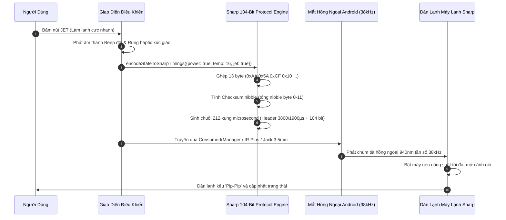

<div align="center">


# sharp-a_c-ir-remote-&-learner-for-android

**Universal Sharp Inverter A/C Remote Simulator & Infrared (IR) Learning Studio for Android**  
*Ứng dụng mô phỏng Remote máy lạnh Sharp Inverter & Phòng thu học lệnh hồng ngoại (IR) đa năng cho mọi thiết bị Android*

[](package.json)
[](https://react.dev/)
[](https://www.typescriptlang.org/)
[](https://vitejs.dev/)
[](https://tailwindcss.com/)
[](https://web.dev/progressive-web-apps/)
[](https://developer.android.com/reference/android/hardware/ConsumerIrManager)
[](LICENSE)

<p align="center" id="top">
  <a href="README.md">English</a>
  &nbsp;&bull;&nbsp;
  <b>Tiếng Việt (Đang xem)</b>
</p>

</div>

---

<div align="right">
  <a href="#top"><b>Lên đầu trang</b></a>
</div>

## Tài liệu Tiếng Việt

### 1. Giới thiệu tổng quan

**`sharp-a_c-ir-remote-&-learner-for-android`** là hệ thống phần mềm chuyên nghiệp mô phỏng điều khiển, giải mã, học và phát tín hiệu hồng ngoại cho tất cả các dòng máy lạnh **Sharp Inverter / Plasmacluster**.

Dự án được tối ưu hóa cho toàn bộ hệ sinh thái Android:
- **Điện thoại Android có sẵn mắt hồng ngoại (IR Blaster)** (Xiaomi, Redmi, Poco, Huawei, Honor, Vivo, Oppo, TCL, HTC, LG...): Điều khiển trực tiếp bằng phần cứng thông qua `ConsumerIrManager` hoặc xuất cấu hình cho ứng dụng IR Plus và Termux.
- **Điện thoại Android không có mắt hồng ngoại** (Samsung Galaxy S series, Google Pixel, OnePlus, máy tính bảng): Hỗ trợ đầy đủ qua cổng tai nghe 3.5mm điều chế sóng vi sai, đầu cắm IR mini cổng Type-C, hoặc bộ phát WiFi IR (Tuya / ESP32).
- **Ứng dụng đóng gói Android WebView (APK)**: Tích hợp sẵn cơ chế cầu nối `window.AndroidIr` giúp gọi trực tiếp phần cứng IR từ web.

<div align="right">
  <a href="#top"><b>Lên đầu trang</b></a>
</div>

---

### 2. Sơ đồ kiến trúc & Nguyên lý hoạt động



<div align="right">
  <a href="#top"><b>Lên đầu trang</b></a>
</div>

---

### 3. Cấu trúc khung truyền Sharp 104-Bit

Tín hiệu hồng ngoại của máy lạnh Sharp sử dụng phương pháp **Điều chế khoảng cách xung (Pulse Distance Modulation - PDM)** trên tần số sóng mang **38.000 Hz (38 kHz)**. Các hằng số định thời đã được xác thực chuẩn xác theo thư viện [IRremoteESP8266](https://github.com/crankyoldgit/IRremoteESP8266) (`ir_Sharp.h`, các dòng điều khiển AY-ZP40KR / CRMC-A907):

```
[HEADER MARK] [HEADER SPACE] [BIT] ... [BIT] [STOP MARK] [GAP]
   3800 µs       1900 µs     470 µs   ...    470 µs     40000 µs
```

- **Header mở đầu**: Xung phát (Mark) 3800 µs + Khoảng lặng (Space) 1900 µs.
- **Bit 0**: Mark 470 µs + Space 500 µs (Chu kỳ 970 µs).
- **Bit 1**: Mark 470 µs + Space 1400 µs (Chu kỳ 1870 µs).
- **Stop Bit**: Mark 470 µs + Space 40000 µs.
- **Tổng số xung trong mảng**: 2 + (104 × 2) + 2 = **212 xung**.
- **Byte kiểm tra (Checksum)**: Tổng tất cả các nibble 4-bit từ byte 0 đến byte 11, lấy 4 bit thấp (mask 0x0F) lưu vào nửa trên byte 12.

#### Cấu trúc 13 Byte dữ liệu Sharp A/C

```
Byte 0:  0xAA  (Customer Code 1)
Byte 1:  0x5A  (Customer Code 2)
Byte 2:  0xCF  (Mã định danh model)
Byte 3:  0x10  (Phiên bản giao thức)
Byte 4:  [Bit 3..0: Nhiệt độ - 15] [Bit 4: Model]
Byte 5:  [Bit 7..4: PowerSpecial (0x0=Giữ nguyên, 0x2=BẬT, 0x1=TẮT)]
Byte 6:  [Bit 1..0: Chế độ (1:Cool, 2:Dry, 3:Auto)] [Bit 3: Clean] [Bit 6..4: Tốc độ quạt]
Byte 7:  [Bit 3..0: Số giờ hẹn] [Bit 6: Loại hẹn giờ (0:BẬT, 1:TẮT)] [Bit 7: Bật hẹn giờ]
Byte 8:  [Bit 2..0: Swing đảo gió (0x00:Tắt, 0x07:Bật/Tự động)]
Byte 9:  Chế độ đặc biệt (Jet, Baby, Gentle Breeze, Sleep, Eco)
Byte 10: Byte đánh dấu lệnh (0x00: bình thường, 0xEE: hủy hẹn giờ, 0xFF: khôi phục gốc)
Byte 11: Cờ Ion / Model2 (0x00 tiêu chuẩn)
Byte 12: [Bit 7..4: Checksum nibble = tổng các nibble từ byte 0-11, mask 0x0F]
```

<div align="right">
  <a href="#top"><b>Lên đầu trang</b></a>
</div>

---

### 4. 15 Nút bấm mô phỏng remote vật lý

| STT | Tên nút | Biểu tượng | Chức năng tiêu chuẩn | Tác động trạng thái |
|:---:|:---|:---:|:---|:---|
| 1 | **ON/OFF** | Power | Bật/tắt nguồn máy lạnh | Đảo trạng thái nguồn, phát âm thanh kép khi mở |
| 2 | **JET** | Zap | Làm lạnh cực nhanh (Super Jet 16°C) | Khóa nhiệt độ 16°C, quạt tốc độ tối đa |
| 3 | **Baby Mode** | Smile | Gió trẻ em dịu êm | Luồng gió êm ái, bảo vệ sức khỏe trẻ nhỏ và người già |
| 4 | **▲ (Tăng nhiệt)** | ChevronUp | Tăng nhiệt độ cài đặt (+1°C) | Khoảng điều chỉnh 16°C đến 30°C (Cool) hoặc ±2°C (Dry) |
| 5 | **▼ (Giảm nhiệt)**| ChevronDown | Giảm nhiệt độ cài đặt (-1°C) | Khoảng điều chỉnh 16°C đến 30°C (Cool) hoặc ±2°C (Dry) |
| 6 | **Gió nhẹ** | Wind | Hướng gió thổi trần nhà | Cánh đảo gió chếch lên trần tránh rọi trực tiếp vào người |
| 7 | **MODE** | Sliders | Chuyển chế độ hoạt động | Làm lạnh (Cool) -> Khử ẩm (Dry) -> Tự động (Auto) |
| 8 | **FAN** | Fan | 5 cấp tốc độ quạt | 1: Êm ái -> 2: Nhẹ -> 3: Thấp -> 4: Cao -> 5: Tự động |
| 9 | **SWING** | RefreshCw | Tự động đảo hướng gió lên/xuống | Cánh đảo gió quét liên tục |
| 10 | **Hẹn giờ BẬT** | Clock | Hẹn giờ mở máy (0.5h đến 12h) | Kích hoạt bộ đếm, sáng đèn LED cam trên dàn lạnh |
| 11 | **Hẹn giờ TẮT** | Clock | Hẹn giờ tắt máy (0.5h đến 12h) | Kích hoạt bộ đếm, sáng đèn LED cam trên dàn lạnh |
| 12 | **ECO** | Leaf | Chế độ tiết kiệm điện | Mức 1 (-3%) -> Mức 2 (-6%) -> Tắt |
| 13 | **SLEEP** | Moon | Chế độ ngủ đêm êm ái | Tự động tăng 1°C sau 1 giờ tránh buốt lạnh |
| 14 | **HỦY HẸN GIỜ** | XCircle | Xóa lịch hẹn giờ đang chạy | Tắt đèn LED hẹn giờ màu cam trên dàn lạnh |
| 15 | **RESET** | RotateCcw | Khôi phục mặc định gốc | Đưa về 24°C, Quạt tự động, xóa toàn bộ hẹn giờ |

<div align="right">
  <a href="#top"><b>Lên đầu trang</b></a>
</div>

---

### 5. 5 Phương thức cấu hình & học lệnh hồng ngoại (Learning Studio)

1. **Mã chuẩn Sharp 104-Bit (Khuyên dùng)**: Bộ mã nạp sẵn đã xác thực theo chuẩn `IRremoteESP8266` cho các dòng điều khiển Sharp A907 / AY-ZP40KR. Độ chính xác 100%, không cần phần cứng học lệnh ngoài.
2. **USB Serial Hardware Receiver (Web Serial API - Chuẩn xác nhất)**: Kết nối Arduino Nano/Uno hoặc ESP32 gắn mắt thu TSOP38238 qua cổng USB hoặc cáp USB-OTG trên điện thoại. Vi điều khiển sử dụng ngắt phần cứng đo xung microsecond chính xác tuyệt đối và truyền thẳng vào trình duyệt qua cổng nối tiếp 115200 baud.
3. **Jack 3.5mm / AudioWorklet IR Demodulator**: Chạy luồng xử lý âm thanh `AudioWorklet` chuyên dụng với chu kỳ tự động hiệu chuẩn sàn nhiễu 1.5 giây, xử lý đảo cực tín hiệu Active-Low cho chip giải mã TSOP và máy hiện sóng (Oscilloscope) đồ họa thời gian thực.
4. **Nhập thủ công (Manual Hex / Timings)**: Dán trực tiếp mảng số microsecond hoặc mã Pronto Hex với công cụ phân tích cấu trúc xung tức thời.
5. **Soi đèn IR qua Camera (Chỉ kiểm tra phát quang)**: Camera điện thoại nhạy cảm với dải hồng ngoại gần (850-940nm), hiển thị ánh sáng tím khi remote bấm phát. *Lưu ý kỹ thuật: Camera 30fps (33.000µs/khung) không thể giải mã chuỗi xung 470µs ở tần số 38kHz, do đó tính năng này dùng để kiểm tra pin và mắt phát của remote thật có còn hoạt động hay không.*

<div align="right">
  <a href="#top"><b>Lên đầu trang</b></a>
</div>

---

### 6. Cài đặt & Phát triển cục bộ (Local Setup)

#### Yêu cầu môi trường
- **Node.js**: phiên bản `>= 18.0.0` (Khuyên dùng Node 20+ hoặc 25)
- **NPM**: phiên bản `>= 9.0.0`

#### Lệnh cài đặt & Chạy ứng dụng

```bash
# 1. Clone repository
git clone https://github.com/your-username/sharp-a_c-ir-remote-&-learner-for-android.git

# 2. Di chuyển vào thư mục
cd sharp-a_c-ir-remote-&-learner-for-android

# 3. Cài đặt các gói phụ thuộc
npm install

# 4. Khởi chạy máy chủ phát triển
npm run dev
```

Mở trình duyệt tại: `http://localhost:3000` (hoặc mở bằng địa chỉ IP mạng nội bộ trên điện thoại Android cùng mạng WiFi).

#### Danh mục câu lệnh quản lý (Scripts)

| Lệnh | Chức năng |
|:---|:---|
| `npm run dev` | Khởi chạy Vite dev server với Hot Module Replacement (cổng 3000) |
| `npm run build` | Biên dịch bản build production tối ưu vào thư mục `dist/` |
| `npm run preview` | Chạy thử nghiệm bản build `dist/` |
| `npm run lint` | Kiểm tra toàn bộ kiểu dữ liệu TypeScript (`tsc --noEmit`) |
| `npm run clean` | Dọn dẹp thư mục `dist/` an toàn trên mọi hệ điều hành |

#### Lệnh Makefile tiện ích (Đóng gói & Cài đặt APK)

| Lệnh Makefile | Chức năng |
|:---|:---|
| `make install` | **Biên dịch bản mới nhất, tạo APK, đẩy về điện thoại và cài đặt ứng dụng ngay lập tức** |
| `make build` | Biên dịch bản build web và tạo file APK tại `android/build/sharp-ac-remote.apk` |
| `make dev` | Khởi chạy máy chủ phát triển Vite (cổng 3000) |
| `make launch` | Khởi chạy ứng dụng Sharp AC Remote trên điện thoại qua ADB |
| `make logcat` | Theo dõi log phát xung hồng ngoại thời gian thực từ mắt IR của điện thoại |
| `make clean` | Dọn dẹp thư mục build và file tạm |

<div align="right">
  <a href="#top"><b>Lên đầu trang</b></a>
</div>

---

### 7. Cấu trúc thư mục (Directory Structure)

```
sharp-a_c-ir-remote-&-learner-for-android/
├── .env.example                     # Mẫu biến môi trường
├── .gitignore                       # Cấu hình loại trừ Git an toàn
├── README.md                        # Tài liệu Tiếng Anh (Mặc định)
├── README.vi.md                     # Tài liệu Tiếng Việt
├── index.html                       # HTML5 Shell & PWA Meta
├── metadata.json                    # Khai báo thông tin dự án
├── package.json                     # Quản lý gói phụ thuộc & scripts
├── tsconfig.json                    # Cấu hình TypeScript
├── vite.config.ts                   # Cấu hình Vite & PWA Service Worker
├── android/                         # Cấu hình đóng gói ứng dụng native Android
├── docs/                            # Tài liệu & hình ảnh banner minh họa
├── public/                          # Icon PWA & manifest
├── scripts/                         # Script tự động hóa build APK & icon
└── src/
    ├── App.tsx                      # Component điều phối chính & chuyển đổi ngôn ngữ
    ├── components/                  # Giao diện remote, dàn lạnh, learning studio
    ├── types/                       # Khai báo kiểu trạng thái A/C & xung IR
    └── utils/                       # Bộ giải mã Sharp, AudioWorklet, Serial IR
```

<div align="right">
  <a href="#top"><b>Lên đầu trang</b></a>
</div>

---

## Giấy phép (License)

- **Giấy phép**: Phân phối theo giấy phép [MIT License](LICENSE).

```text
Made with ❤️ by nhattan
```
